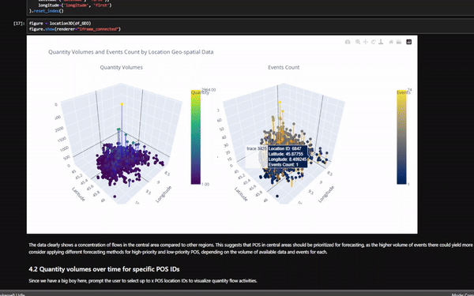
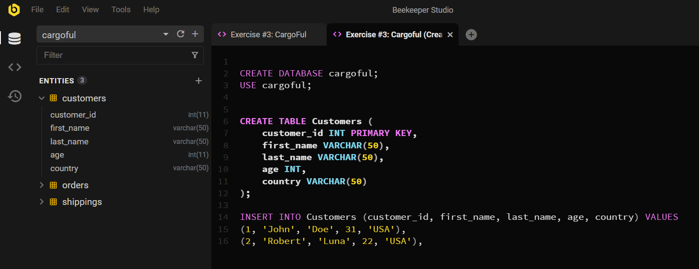
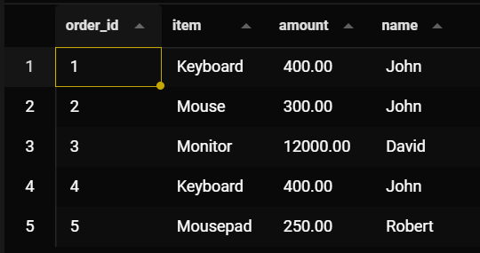
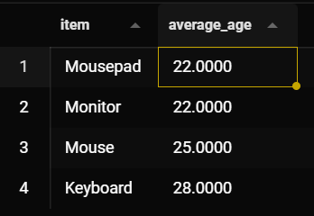

<table style=" width: 100%; border-collapse: collapse;">
  <tr>
    <td style="vertical-align: middle;">
      
    </td>
    <td style="vertical-align: middle; padding-left: 10px;">
      <h1 style="display: inline; font-size: 2em; font-weight: bold; margin: 0;">CargoFul Exercises</h1>
    </td>
  </tr>
</table>

Welcome to the **CargoFul Technical Interview Exercises** repository! This repository contains my solutions to analytical exercises completed as part of the technical interview process with CargoFul.

## Table of Contents
1. [Overview](#overview)
2. [Getting Started](#getting-started)
3. [Exercises](#exercises)
    - [Exercise 1: Time Series Analysis and Forecasting](#exercise-1-time-series-analysis-and-forecasting)
    - [Exercise 2: Spatial Analytics](#exercise-2-spatial-analytics)
    - [Exercise 3: SQL](#exercise-3-sql)
---

## Overview

This repository demonstrates my approaches to various data analysis and algorithm development challenges. Each exercise includes structured, self-contained code to allow for easy understanding and reproducibility of results.

> **⚠️ NOTE:** <span style="color: red;">Due to privacy concerns, the CSV file containing historical POS data is not included in this repository and is ignored during upload. Collaborators should manually upload the required CSV file in the `DATA` directory to run the code successfully.</span>

## Getting Started

To view, test, and modify the solutions in this repository:

1. **Clone the repository**:
    ```bash
    git clone https://github.com/yourusername/CargoFul_exercises.git
    ```
2. **Navigate to the project directory**:
    ```bash
    cd CargoFul_exercises
    ```
3. **Create a Virtual Environment**:
    ```bash
    python -m venv venv   # For Windows
    venv\Scripts\activate
    ```
4. **Install dependencies** (e.g., time series and spatial libraries):
    ```bash
    pip install -r requirements.txt
    ```
5. **Start Jupyter Lab**:
    ```bash
    jupyter lab
    ```

---

## Exercises

### Exercise 1: Time Series Analysis and Forecasting

This exercise involves analyzing and forecasting time series data for POS (points of sale) to predict future values for each location ID. The steps include data preprocessing, handling outliers, prioritizing specific POS IDs, and using the auto-ARIMA forecasting model.

#### Solution Steps:
1. **Dataset Quality Assessment**: Examine dataset structure, check for missing values, and ordering, and review key patterns.
2. **POS IDs Ranking**: Prioritize POS IDs based on forecast relevance.
3. **Outliers Cleaning**: Identify and adjust outliers to improve forecast accuracy.
4. **Cross-Validation**: Use cross-validation to evaluate model performance.
5. **ARIMA Algorithm**: Apply the auto-ARIMA forecasting model to account for hyperparameter tuning and AIC criterion.
6. **Algorithm Assessment**: Evaluate model accuracy using metrics like Ljung-Box Q, Variance, RMSE and Log-Likelihood.

View (partially) the Notebook directly via [nbviewer](https://nbviewer.org/github/AtlasAnatomy/CargoFul_exercises/blob/main/Time_series_POS.ipynb).



Note: the nbviewer or Jupyter light are tools that can't use some features like widgets or visualize 3D plots. For a complete representation of the notebook, refer to the [Getting Started](#getting-started) section.

### Exercise 2: Spatial Analytics

This exercise focuses on spatial data analysis, aimed at uncovering geographic patterns through clustering and distance calculations.

#### Solution Outline:
1. **Spatial Clustering**: Group data points based on geographic proximity.
2. **Distance Calculations**: Calculate distances between locations for spatial analysis.
3. **Visualization**: Generate maps to visualize spatial patterns.

### Exercise 3: SQL

The third exercise focuses on SQL-based queries for retrieving and manipulating data in a database containing customers' PII (Personally Identifiable Information), orders, and shipment statuses.

To begin, we will set up the database using Beekeeper Studio, with XAMPP enabling the local Apache server. The recommended approach is to either upload a .csv file or an .sql file to create the database. 
For this exercise, however, we will create the database manually from scratch and populate it with the three tables.
```bash
CREATE DATABASE cargoful;
USE cargoful;

CREATE TABLE Customers (
    customer_id INT PRIMARY KEY,
    first_name VARCHAR(50),
    last_name VARCHAR(50),
    age INT,
    country VARCHAR(50)
);

INSERT INTO Customers (customer_id, first_name, last_name, age, country) VALUES
(1, 'John', 'Doe', 31, 'USA'),
(2, 'Robert', 'Luna', 22, 'USA'),
(3, 'David', 'Robinson', 22, 'UK'),
(4, 'John', 'Reinhardt', 25, 'UK'),
(5, 'Betty', 'Doe', 28, 'UAE');

CREATE TABLE Orders (
    order_id INT PRIMARY KEY,
    item VARCHAR(50),
    amount DECIMAL(10, 2),
    customer_id INT,
    FOREIGN KEY (customer_id) REFERENCES Customers(customer_id)
);

INSERT INTO Orders (order_id, item, amount, customer_id) VALUES
(1, 'Keyboard', 400, 4),
(2, 'Mouse', 300, 4),
(3, 'Monitor', 12000, 3),
(4, 'Keyboard', 400, 1),
(5, 'Mousepad', 250, 2);


CREATE TABLE Shippings (
    shipping_id INT PRIMARY KEY,
    status VARCHAR(50),
    customer INT,
    FOREIGN KEY (customer) REFERENCES Customers(customer_id)
);

INSERT INTO Shippings (shipping_id, status, customer) VALUES
(1, 'Pending', 2),
(2, 'Pending', 4),
(3, 'Delivered', 3),
(4, 'Pending', 5),
(5, 'Delivered', 1);
```


#### Question 1:
```bash
-- Question 1 --
SELECT o.order_id, o.item, o.amount, c.first_name as name
FROM Orders AS o
LEFT JOIN Customers AS c ON o.customer_id = c.customer_id;
```
This first query performs a basic LEFT JOIN on the Orders table's foreign key, customer_id, linking it to the Customers table by its primary key, customer_id. 
Aliases are used to simplify and enhance the readability of the query. 
The selected columns include order_id, item, amount, and the customer's full name.



#### Question 2:
```bash
-- Question 2 --
SELECT
    o.item,
    AVG(age) AS average_age
FROM
    Orders AS o
LEFT JOIN
    Customers AS c ON o.customer_id = c.customer_id
GROUP BY
    item
ORDER BY
    average_age ASC;
```
This second query performs a LEFT JOIN similar to the one above, linking Orders to Customers by customer_id. It then groups the results by item name and calculates the average age of customers who purchased each item. 
Finally, the results are sorted in ascending order by the average age column.



#### Question 3:
```bash
-- Question 3 --
SELECT
    SUM(amount) AS total_amount,
    COUNT(DISTINCT o.item) AS item_types,
    c.country
FROM
    Orders AS o
LEFT JOIN
    Customers AS c ON o.customer_id = c.customer_id
GROUP BY
    country
ORDER BY
    total_amount DESC;
```
The final query also uses a LEFT JOIN, grouping results by country to calculate the total sales amount and count the distinct items sold in each country. 
The output is then sorted in descending order by total sales amount.


---

Thank you for checking out my solutions and Happy coding!
